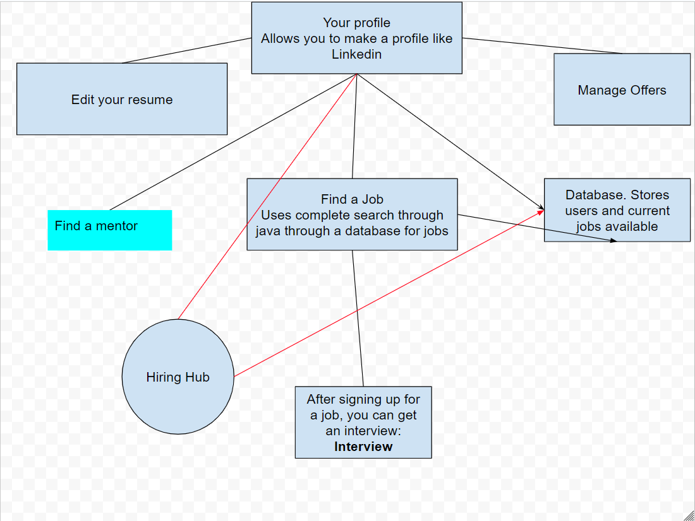

This project will involve trying to help find jobs.


The above is a diagram demonstrating how everything works
The project itself issue: [Link](https://github.com/RIK-CSA/RIK-CSA-backend/issues/1)

Sample Java Complete Search Code:
```java
private static int linearSearch(int[] array, int key) {
        for (int i = 0; i < array.length; i++) {
            if (array[i] == key) {
                return i; // Element found, return its index
            }
        }
        return -1; // Element not found in the array
    }
```